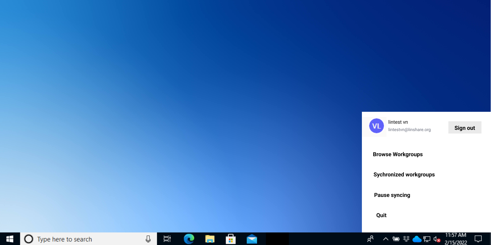
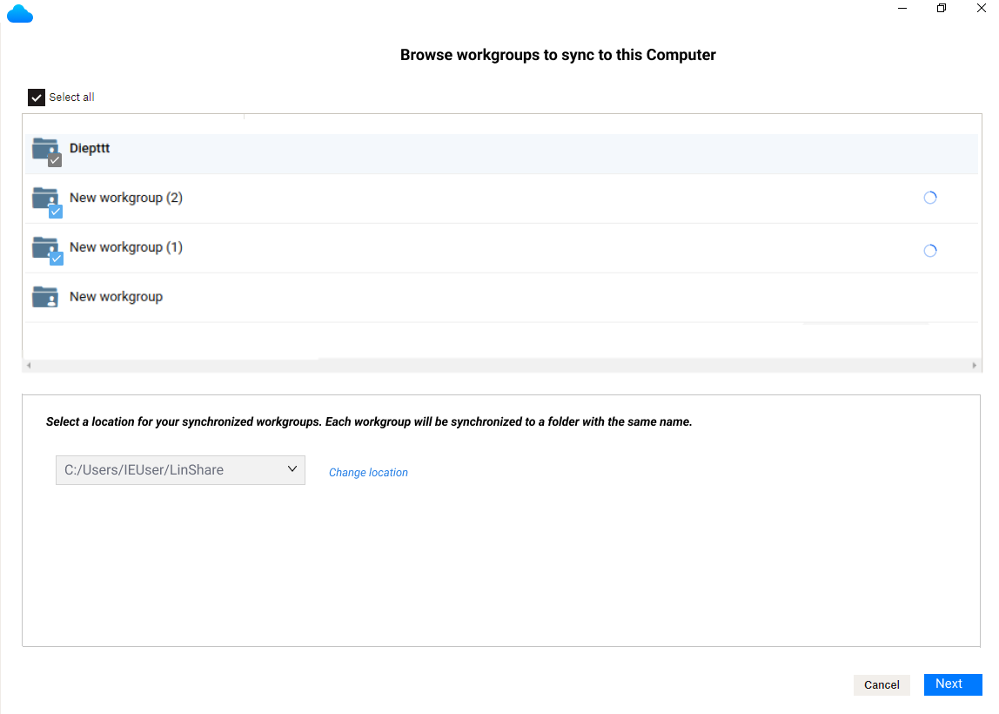

# Summary

* [Related EPIC](#related-epic)
* [Definition](#definition)
* [UI Design](#ui-design)
* [Misc](#misc)

## Related EPIC

* [Desktop synchronization client](./README.md)

## Definition

#### Preconditions

- Given that I have installed LinShare desktop app in my computer
- Given that I had LinShare account 

#### Description

- After login successfully to LinShare desktop app:
    - If I have not added any synchronized workgroup, I am redirected automatically to screen: "Browse Workgroups to sync with this computer "
    - If I have any synchronized workgroup, I am redirected automatically to screen: "Synchronized Workgoups"
- Or When I click on LinShare icon LinShare at the bottom right or top right, I can see a menu and I select option: "Browse Workgroups", then the screen "Select Workgroups to sync with this computer" will be opened.
- On this screen, I can see the list of workgroups that:
   - I have writer or admin roles on it
   - The versioning is enabled on that workgroup
- If the workgroup is synchronized before, it still appears in the list but with checkbox selected and non-editable.
- I can select 1 or multiple workgroups by select checkbox next to each workgroup in the list
- I can see the text below: "Select a location for your synchronized workgroups. Each workgroup will be synchronized to a folder with the same name." and a field below
- I Can see the default location of the synchronized folder is shown: C:/Users/MyUser/LinShare: This will create a new folder:"LinShare" 
- I can click chevron icon on the field, then the system file browser will be opened and I can select another location. This field cannot be blank.
- I click button Next, then each selected workgroups will be synchronized:
   - If in selected workgroups, there are any 2 workgroups with the same name, there will be an error message : 2 workgroups with the same name cannot be in a same folder
   - If there is already a folder with same name of any selected workgroups , there will be an error message: "A folder with the name [] already exists."
- In syncing process, I can see a spinner icon in each workgroup
- When the syncing is completed, the icon complete will be shown with the last sync date with the status (success or failure)
- Now, I can see the location field is in read mode
- I can click button Open folder, then the system will open synchronized folder.
- Each workgroup will be synchronized to a folder with the same name with that workgroup
- When I open one synchronized folder, I can see all the files/folders inside as same as web version

#### Postconditions

[Back to Summary](#summary)

## UI Design

#### Mockups

#### Final design

[Back to Summary](#summary)

## Misc

[Back to Summary](#summary)

