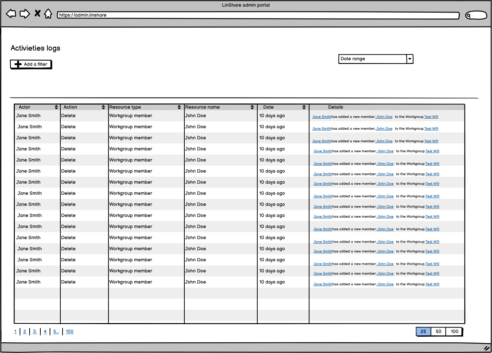

# Summary

* [Related EPIC](#related-epic)
* [Definition](#definition)
* [UI Design](#ui-design)
* [Misc](#misc)

## Related EPIC

* [Guests-User](./README.md)

## Definition

#### Preconditions

- Given that I am a LinShare user
- After log-in successfully to LinShare, I select Activities

#### Description

**1. Filter audit log**
- In new view I can see the filter: Date range
   - When I click on this field, I can select pre-defined period : Today, Yesterday, Last seven days, Last 2 weeks, Last 30 days, Last month, This month, Last 6 months
   - Or I can customize the start date and end date
- When I click on button Add filters, I can select additional filters: Resource type, Resource name, Action, Actor
- Resource groups:
    - when I select this filter, there will be a drop-down list listing all resource groups of audit logs
    - There are 8 groups and each groups can contain multiple resource types:
        - Shared Space: Workspace, Workgroup, Workspace member, Workgroup member, Workgroup document, Workgroup folder, Workgroup revision
        - Myspace: Document
        - Upload request: Upload request, Upload request Group, Upload request URL, Upload request document
        - Share: Share entry, Anonymous share
        - Guest: Guest
        - Contact: Contact, Contact list
        - User: Account, Authentication, JWT token.
    - I can select one or multiple resource types from the list, then it will be displayed as a filter criteria in the row below as: "Resource type: [ selected option1 ] or [selected option2 ] or ..." and a delete icon next to it.
    - If I click enter, the system will search all the audit logs that belong to selected resource type.
- Resource name:
    - When I select this filter, there will be a dialog that allow me to input text amd click button Apply
    - Then it will be displayed as a filter criteria in the row below: "Resource name: inputted text" and a delete icon next to it.
    - If I click  Enter, the system will search all the audit logs that  has resource name contains inputted text.
- Action:
    - when I select this filter, there will be a drop-down list listing all actions of audit logs
    - I can select one action from the list, then it will be displayed as a filter criteria in the row below as: "Action: [ selected option1 ] or [ selected option2 ] or ..." and a delete icon next to it.
    - If I click enter, the system will search all the audit logs that belong to selected action
- Auth user:
    - When I select this filter, there will be a dialog with a search field
    - when I input some characters in the search field, the system will display suggestion list and I can select one auth user from the list.
    - I can search auth user by email or uuid
    - Then it will be displayed as a filter criteria in the row below: "Auth user: selected user" and a delete icon next to it.
    - If I click  Enter, the system will search all the audit logs which have auth user as selected.

- I can filter audit logs by one of above criteria or combine them
- Each search criteria in the search bar is seperated by a delete icon. I can click this icon to delete the criteria
- I can also click button Clear filter to delete all current selected filter

**2. Display the result**

- After selecting filter, I click button Enter, the system will execute searching audit logs with selected filter conditions and display the result below, including columns:

    - Actor
    - Action
    - Resource type
    - Resource name
    - Date: When I hover the date, there will be a popover that displays detail date - time
    - Details

#### Postconditions

- With filters Resources type and Action, user can select multiple options and the search operator for these 2 filters is "Or"
- With filter Resource name, user can only search by one option
- The audit logs list will be paginated with default row is 25, I can change the number at the bottom of page.
- In the audit log table, I can sort ascending and descending in each column (except column Detail)
- Default sort is latest date time
- When an action is performed by a technical account, the actor displayed in the trace list is the name of the user. There will be an information icon next to actor name. If I hover/click on this icon, there will be a popover:" This action is performed by [technical account's name] on behalf of [user name]
- When I click on a specific resource or hover the resource, there will be a popover with option: "View all related traces". When I select this option, the system will search and display all related traces of that specific resource

[Back to Summary](#summary)

## UI Design

#### Mockups

#### Final design

[Back to Summary](#summary)
## Misc

[Back to Summary](#summary)
