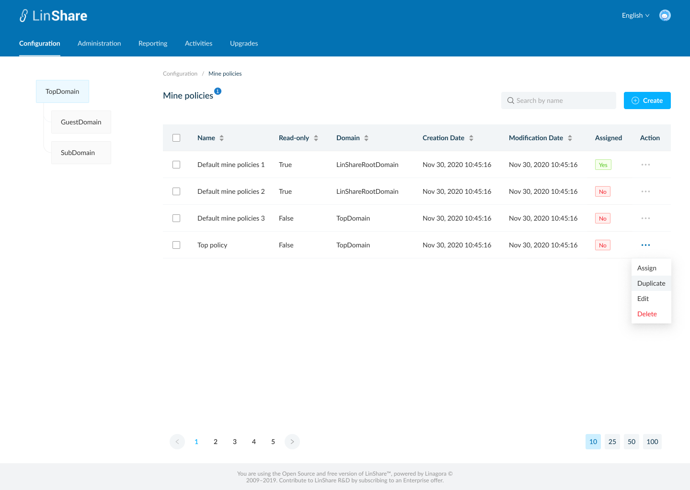
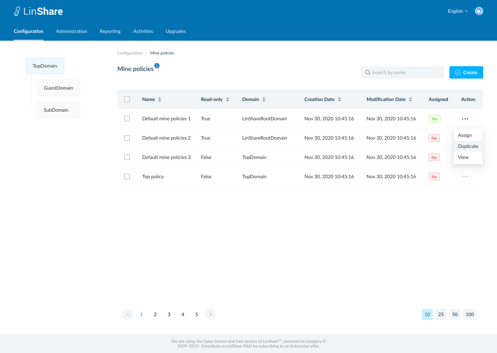

# Summary

* [Related EPIC](#related-epic)
* [Definition](#definition)
* [Screenshots](#screenshots)
* [Misc](#misc)

## Related EPIC

* [New admin portal](./README.md)

## Definition

#### Preconditions

* Given that i am super-admin or nested admin in LinShare 
* I logged-in to Admin portal successfully

#### Description

- I select a domain in Domain tree and go to Configuration tab on top navigation bar
- I click on Mime policies, the screen Mine policies listing list will be opened.

**UC1.Super-admin view the list of mime policies**
- If i am selecting root domain in domain tree, i can see the list of mime policies that i created. They can be used for any lower-level domains.
- If i am selecting a nested domain in the domain tree, i can see the list of mime policies that created by that domain and the mime policies from higher level domain. 
- I can see a tooltip icon on screen name, which i can click on and see the explaination text. 
- The mime policies list includes columns:
   - Name
   - Read-only: True/False. If false, this mime policy is created by the selected domain on tree memu. If true, this mime policy is created by the higher-level domain. 
   - Domain: The name of domain that created the mime policy
   - Creation date
   - Modification date
   - Assigned: Yes/No. This column indicates which mime policy is used for the current selected domain in the domain tree. Each domain can use only 1 mime policy a time 
   - Action: When i click on three-dot button, i can see actions: 
      - If the selected domain is root domain, the actions are: Duplicate, Edit, Delete. 
      - If the selected domain is a nested domain (top domain/Sub domain/Guest domain), the actions are: Assign, Duplicate, Edit, Delete
      - If the mime policy is currently used, the option "Assign" is disabled. 

**UC1.Super-admin view the list of mime policies**
   - I can see the list of mime policies that created for selected domain, which can be used for lower-level domain, and mime policies from higher-level domain. 
   - The mime policies list includes columns:
      - Name
      - Read-only: True/False. If false, this mime policy is created by the selected domain on tree memu. If true, this mime policy is created by the higher-level domain. 
      - Domain: The name of domain that created the mime policy
      - Creation date
      - Modification date
      - Assigned: Yes/No. This column indicates which mime policy is used for the current selected domain in the domain tree. Each domain can use only 1 mime policy a time 
   - Action: When i click on three-dot button, i can see actions: 
      - If the mime policies is from my higher-level domain (eg: i am admin of Top domain and the mime policy is from Root domain), i can see the action: Assign, Duplicate, View
      - If the mime pilicy is from my domain or lower-level domain, i can see the action: Assign, Duplicate, Edit, Delete
#### Postconditions

- I can sort by columns: Name, Read only, Domain, Creation date, Modification date
- Default sort is last modification date
- The mime policies list is paginated and the default number of displayed items is 25, I can change this number at the bottom of page
- I can see a search bar and typing in, the system will search by Mime policy's name and display corresponding result in the table below
- When i click button "Create", the screen Create new mime policy screen will be opened.
- If i log-in as nested admin, i can only see the domain tree that contains only my nested domain and see the  mime policies list of my nested domain

[Back to Summary](#summary)

## UI Design

#### Mockups

#### Final design

[Back to Summary](#summary)
## Misc

[Back to Summary](#summary)

