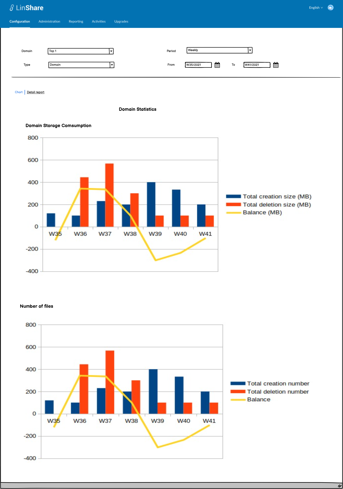
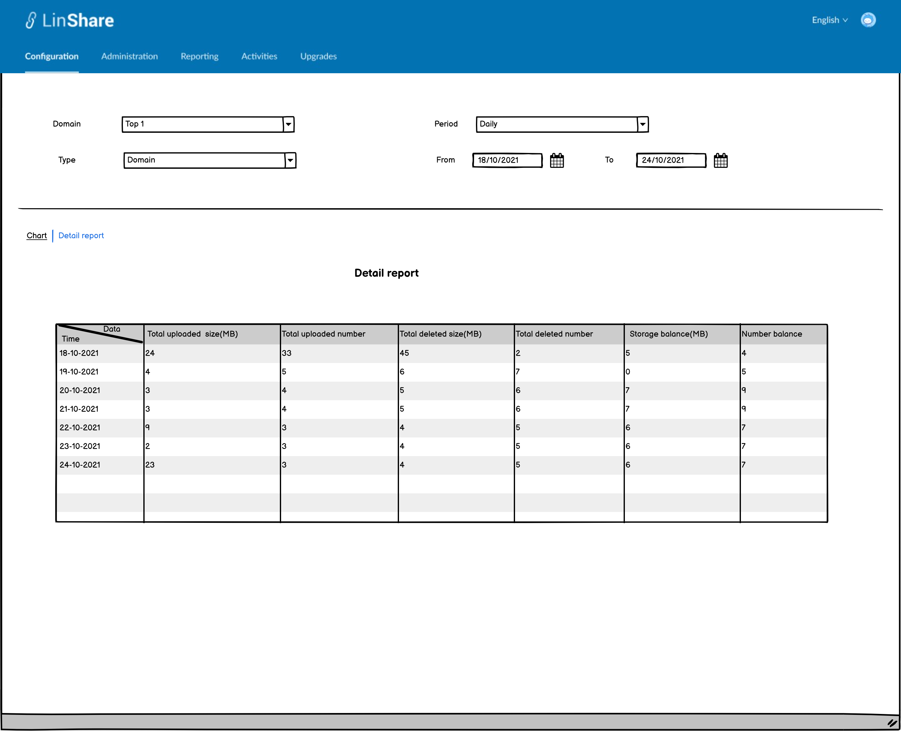
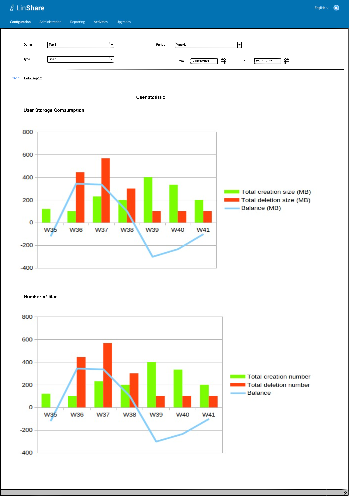
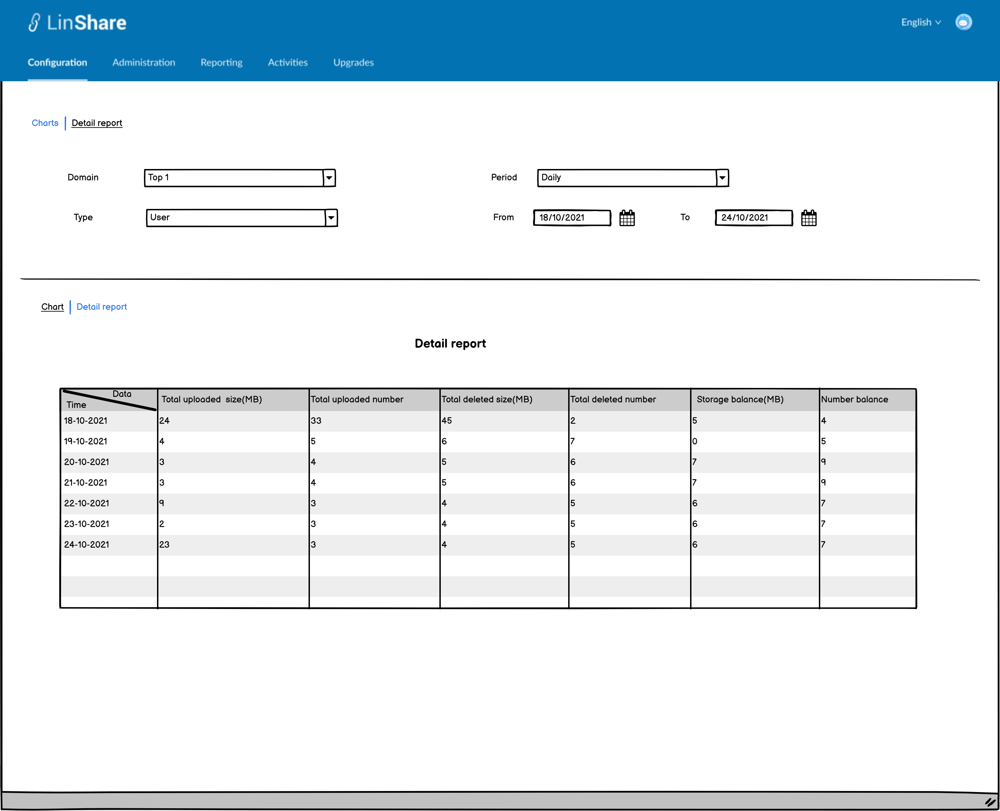

# Summary

* [Related EPIC](#related-epic)
* [Definition](#definition)
* [UI Design](#ui-design)
* [Misc](#misc)

## Related EPIC

* [New admin portal](./README.md)

## Definition

#### Preconditions

- Given that am super admin or nested admin of LinShare
- After log-in successfully, I go to  Tab Reporting
- A new page will be opened.

#### Description

- On this new screen I can see 2 charts: Storage consumption and Quantity of files
    - Filters include:
        - Domain
        - Category
        - Time: 
           - If I select Last 7 days: The charts will display 7 columns 
           - Last 30 days: 4-5 columns, each column = a week 
           - Last 6 months: 6 columns, each column = a month
           - Last year: 4 columns, each column = a quarter
           - Custom range: the number of columns will be calculated and display so that the number of columns is not more than 7, and prefer nearest smaller unit of time.
- After I select filters Domain/Category/time then click Enter, these 2 charts will be displayed accordingly:
- Storage consumption: This is a mixed graph between 2 bars chart and a line chart
   - The horizontal axis is display time period with the unit is selected from the filters above
   - The vertical axis displays size (MB) 
   - 2 bars represent for total size of creation (upload files) and total size of deleted files on the domain 
   - A line chart reflects the balance between creation and deletion and is defined as [total creation size] - [total deletion size]
   - When I hover the chart, I can see a popup that shows detail number at every time point. For ex:
      - Aug 20: 
         - Upload: 23MB
         - Delete: 20MB
         - Balance: 3MB
      
- Number of files: This is a mixed graph between 2 bars and a line chart 
   - The horizontal axis is display time period with the unit is selected from the filters above
   - The vertical axis displays number
   - 2 bars represent for total number of creation (upload files) and total number of deleted files on the domain
   - A line chart reflects the balance between creation and deletion number and is defined as [total creation number] - [total deletion number]
   - When I hover the chart, I can see a popup that shows detail number at every time point. For ex:
      - Aug 20:
          - Upload: 23 files
          - Delete: 20 files
          - Balance: 3 files
          
#### Post-conditions

- A Top Domain's quota contains 3 parts: Personal spaces quota and Sharedspace quota and sub-domains quota
- A subdomain's quota contains Personal spaces quota and Sharedspace quota
- If in the filter "Category", I select "whole domain", the statistics is calculated on all Personal spaces and Sharedspace of the domain and sub-domain quota (if any) is not included
- If in the filter "Category", I select ""Shared Space", the statistics is calculated on all Sharespace (all workgroups) of the domain
- If in the filter "Category", I select "Myspace", the statistics is calculated on Personal Spaces of all user of the domain.
- When I change the filter condition, the charts and detail report are also changed accordingly.
- If I am root admin, I can see statistics about storage consumption and quantity of files in all platform or any domain
- If I am nested admin, I can see statistics about storage consumption and quantity of files in my own domain and my nested domains (if any).

[Back to Summary](#summary)

## UI Design

#### Mockups

#### Final design

[Back to Summary](#summary)
## Misc

[Back to Summary](#summary)

